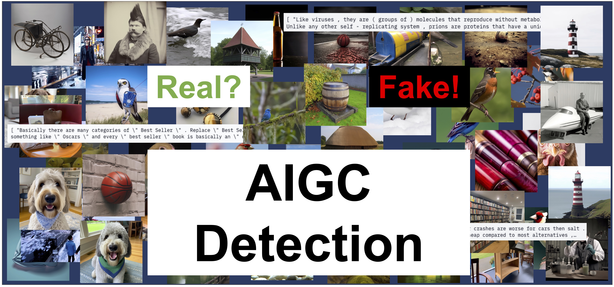

# Awesome-AIGC-Detection

The rapid development of AIGC(AI-Generated Content) has significantly influenced our daily life and how to detect them become a crucial challenge for AI safety now. This is a collection list of AIGC Detection related research that aims to facilitate the development of related fields.

If you find this list helpful in your research, your star and recommendation will be my pleasure. If you want to contribute to this list, welcome to send me a pull request or contact me :)

If you are also interested in Deepfakes Detection, please refer to: [Awesome Deepfakes Detection](https://github.com/Daisy-Zhang/Awesome-Deepfakes-Detection).

## Research Papers

* LaRE2: Latent Reconstruction Error Based Method for Diffusion-Generated Image Detection, CVPR 2024: [Paper](https://arxiv.org/abs/2403.17465)

* How to Trace Latent Generative Model Generated Images without Artificial Watermark? ICML 2024: [Paper](https://arxiv.org/abs/2405.13360)

* DRCT: Diffusion Reconstruction Contrastive Training towards Universal Detection of Diffusion Generated Images, ICML 2024: [Paper](https://icml.cc/virtual/2024/poster/33086)

* Rethinking the Up-Sampling Operations in CNN-based Generative Network for Generalizable Deepfake Detection, CVPR 2024: [Paper](https://arxiv.org/abs/2312.10461) [Code](https://github.com/chuangchuangtan/NPR-DeepfakeDetection)

* Mastering Deepfake Detection: A Cuting-Edge Approach to Distinguish GAN and Difusion-Model Images, ACM Transactions on Multimedia Computing, Communications and Applications 2024: [Paper](https://dl.acm.org/doi/pdf/10.1145/3652027)

* Robust Image Watermarking using Stable Diffusion, arXiv 2024: [Paper](https://arxiv.org/abs/2401.04247)

* Organic or Diffused: Can We Distinguish Human Art from AI-generated Images? arXiv 2024: [Paper](https://arxiv.org/abs/2402.03214)

* GenDet: Towards Good Generalizations for AI-Generated Image Detection, arXiv 2024: [Paper](https://arxiv.org/abs/2312.08880)

* FakeBench: Uncover the Achilles’ Heels of Fake Images with Large Multimodal Models, arXiv 2024: [Paper](https://arxiv.org/abs/2404.13306)

* A Single Simple Patch is All You Need for AI-generated Image Detection, arXiv 2024: [Paper](https://arxiv.org/abs/2402.01123)

* WildFake: A Large-scale Challenging Dataset for AI-Generated Images Detection, arXiv 2024: [Paper](https://arxiv.org/abs/2402.11843)

* DIRE for Diffusion-Generated Image Detection, ICCV 2023: [Paper](https://openaccess.thecvf.com/content/ICCV2023/papers/Wang_DIRE_for_Diffusion-Generated_Image_Detection_ICCV_2023_paper.pdf) [Code](https://github.com/ZhendongWang6/DIRE)

* Seeing is not always believing: Benchmarking Human and Model Perception of AI-Generated Images, NeurIPS 2023: [Paper](https://proceedings.neurips.cc/paper_files/paper/2023/file/505df5ea30f630661074145149274af0-Paper-Datasets_and_Benchmarks.pdf) [Code](https://github.com/Inf-imagine/Sentry)

* Learning on Gradients: Generalized Artifacts Representation for GAN-Generated Images Detection, CVPR 2023: [Paper](https://openaccess.thecvf.com/content/CVPR2023/papers/Tan_Learning_on_Gradients_Generalized_Artifacts_Representation_for_GAN-Generated_Images_Detection_CVPR_2023_paper.pdf)

* Towards Universal Fake Image Detectors that Generalize Across Generative Models, CVPR 2023: [Paper](https://openaccess.thecvf.com/content/CVPR2023/papers/Ojha_Towards_Universal_Fake_Image_Detectors_That_Generalize_Across_Generative_Models_CVPR_2023_paper.pdf) [Code](https://github.com/WisconsinAIVision/UniversalFakeDetect)

* Detecting Images Generated by Deep Diffusion Models using their Local Intrinsic Dimensionality, ICCV workshop 2023: [Paper](https://openaccess.thecvf.com/content/ICCV2023W/DFAD/papers/Lorenz_Detecting_Images_Generated_by_Deep_Diffusion_Models_Using_Their_Local_ICCVW_2023_paper.pdf)

* Exposing the Fake: Effective Diffusion-Generated Images Detection, arXiv 2023: [Paper](https://arxiv.org/abs/2307.06272)

* GenImage: A Million-Scale Benchmark for Detecting AI-Generated Image, arXiv 2023: [Paper](https://arxiv.org/abs/2306.08571) [Code](https://github.com/GenImage-Dataset/GenImage)

* PatchCraft: Exploring Texture Patch for Efficient AI-generated Image Detection, arXiv 2023: [Paper](https://arxiv.org/abs/2311.12397)

* CNN-generated images are surprisingly easy to spot...for now, CVPR 2020: [Paper](https://openaccess.thecvf.com/content_CVPR_2020/papers/Wang_CNN-Generated_Images_Are_Surprisingly_Easy_to_Spot..._for_Now_CVPR_2020_paper.pdf) [Code](https://github.com/peterwang512/CNNDetection)
