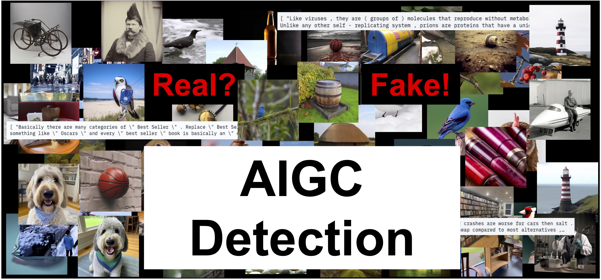

# Awesome-AIGC-Detection

<small>*(image from internet)*</small>

A collection list of AIGC Detection related datasets, tools, papers, and code. If this list helps you on your research, a star will be my pleasure :)

If you want to contribute to this list, welcome to send me a pull request or contact me :)

If you are also interested in Deepfakes Detection, please refer to: [Awesome Deepfakes](https://github.com/Daisy-Zhang/Awesome-Deepfakes-Detection).

## Contents
